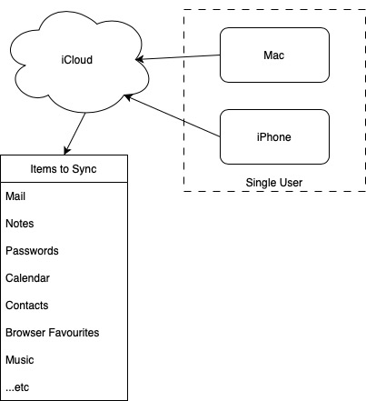
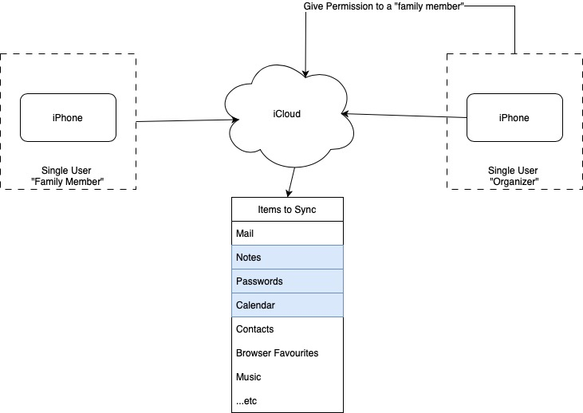
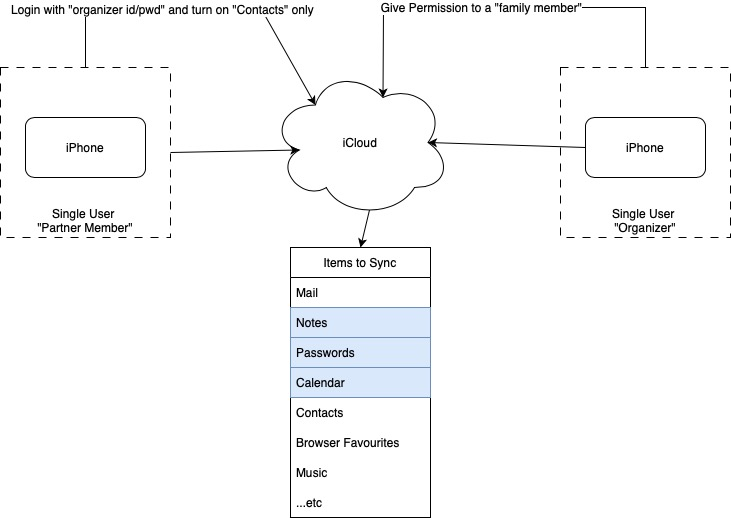

# Walled Garden
Intially an Apple ID (aka an account) was meant for services to sync for a single user :
 

# Expanded to Family
Apple introduces "Family" sharing which is useful, but NOT all items are shareable or follow the same rules for outside of the "garden".

* Passwords must be in a "group" to be shared with family member(s)
* Notes can be shared individually or via folder
* Calendar can be shared as is with family member(s)

# Partner
Unfortunetly Apple does NOT sync "contact" information between iCloud family members.  Members can "share" which means send a copy.  The only work around
currently is to sign in with the same account and just sync contacts.

## Reference
* Basics - https://support.apple.com/en-ca/108380
