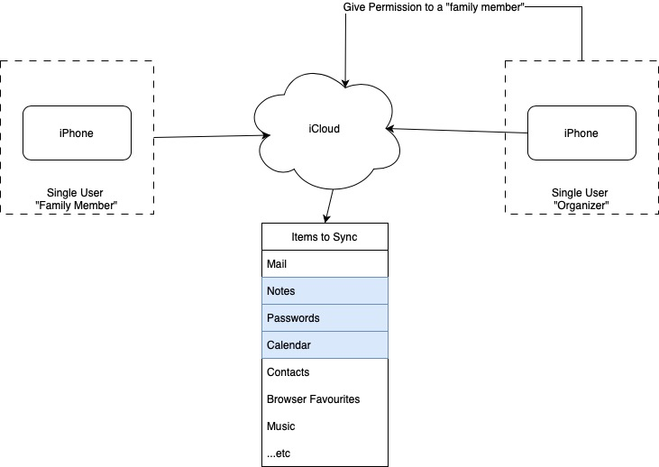

# Walled Garden
Intially an Apple ID (aka an account) was meant for services to sync for a single user :
 

# Expanded to Family
Apple introduces "Family" sharing which is useful, but NOT all items are shareable or follow the same rules for outside of the "garden".

## Reference
* Basics - https://support.apple.com/en-ca/108380
